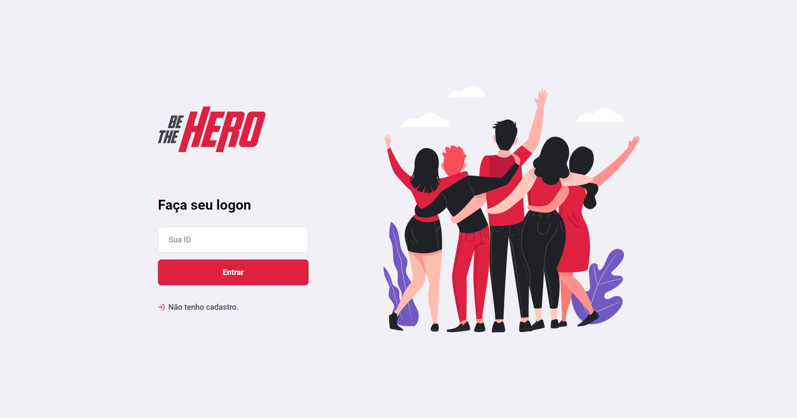

<h1 align="center">
    
</h1>

<h4 align="center">
  Um projeto da Semana OmniStack 11.0
</h4>

O Be The Hero visa ajudar instituições que estão passando por situações precárias e precisam de ajuda financeira.

  

  
  
  

  

  

  <a href="#tecnologias">Tecnologias</a>&nbsp;&nbsp;&nbsp;|&nbsp;&nbsp;&nbsp;
  <a href="#aplicação-web">Web</a>&nbsp;&nbsp;&nbsp;|&nbsp;&nbsp;&nbsp;
    <a href="#aplicação-mobile">Mobile</a>&nbsp;&nbsp;&nbsp;|&nbsp;&nbsp;&nbsp;
  <a href="#como-contribuir">Como contribuir</a>&nbsp;&nbsp;&nbsp;|&nbsp;&nbsp;&nbsp;
  <a href="#-licença">📝 Licença</a>

 

### Tecnologias

Esse projeto foi desenvolvido com as seguintes tecnologias:

- [NodeJS](https://nodejs.org/en/)
- [ReactJS](https://reactjs.org)
- [React Native](https://facebook.github.io/react-native/)
- [Expo](https://expo.io/)

### Aplicação Web

[View User Experience and Design on Youtube](https://youtu.be/gDxJ0y99-y8)

<h1 align="center">
    
</h1>

### Aplicação Mobile

[View User Experience and Design on Youtube](https://youtu.be/gDxJ0y99-y8)

<h1 align="center">
    
</h1>

### Como contribuir

- Faça um fork desse repositório;
- Cria uma branch com a sua feature: `git checkout -b minha-feature`;
- Faça commit das suas alterações: `git commit -m 'feat: Minha nova feature'`;
- Faça push para a sua branch: `git push origin minha-feature`.

Depois que o merge da sua pull request for feito, você pode deletar a sua branch.
 

## 📝 Licença

Esse projeto está sob a licença MIT. Veja o arquivo [LICENSE](LICENSE.md) para mais detalhes.

---

Base desenvolvida por Igor Ryan
